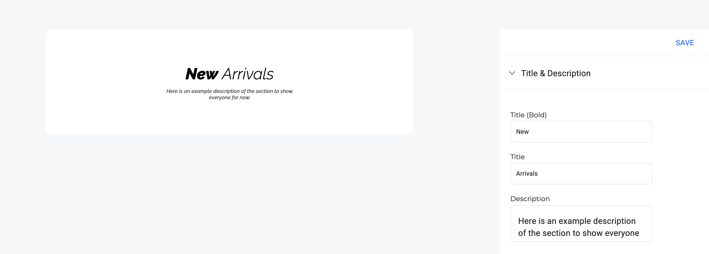

# Download and Run Project
1. Download project and extract zip
2. run ```npm i```


# Overview of Component Build Specs
Every component we integrate into our (CMS) Content Management System must be able to be cusomized in realtime by our users. In order to accomplish this, each component must use three components: the default component, the live-preview component, and the menu component. 

### The Default Component
The default component is what will be seen on a live website, complete with three screen resolutions: desktop, tablet, mobile.

### The Live-preview Component
The live-preview component is the same as the default component, with two differences: 
1. It wraps the default-component within another component that scales its width and height to fit in a preview box
2. Its props are set first with the dummy-data, and then later can also be changed dynamically via:
```typescript
React.useState()
```

### The Menu Component
The menu component a secondary component that contains a set of fields and/or buttons that can be used to change the props values of the live-preview component. 


#### Example Component 
<table><tr><td>
    
</td></tr></table>

#### Example Live-preview and Menu Component 
<table><tr><td>
    
</td></tr></table>

As you can see in the image above, the values that are entered into the fields correspond to the values in the live-preview component. You can see a live preview of this by going to ```http://localhost:xxxx/page-editor```, where xxxx is the port number you're using. 

# Create CMS Folder Structure
1. Go to ```src/page-plugins/```
2. Create a folder, using Pascal-case, using the component name, for example NewComponentName
3. Within the newly created folder, further create three tsx files:
   * NewComponentName.tsx
   * NewComponentName_Menu.tsx
   * NewComponentName_Preview.tsx


```typescript
<div style={{ width : 700}}>
<ContainerTitled sx={{ container : { paddingLeft : 0, paddingRight : 0 }}} notitle>
```
